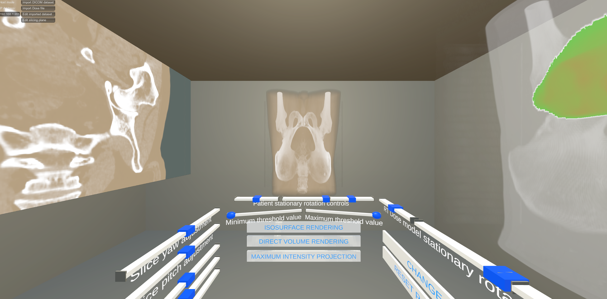
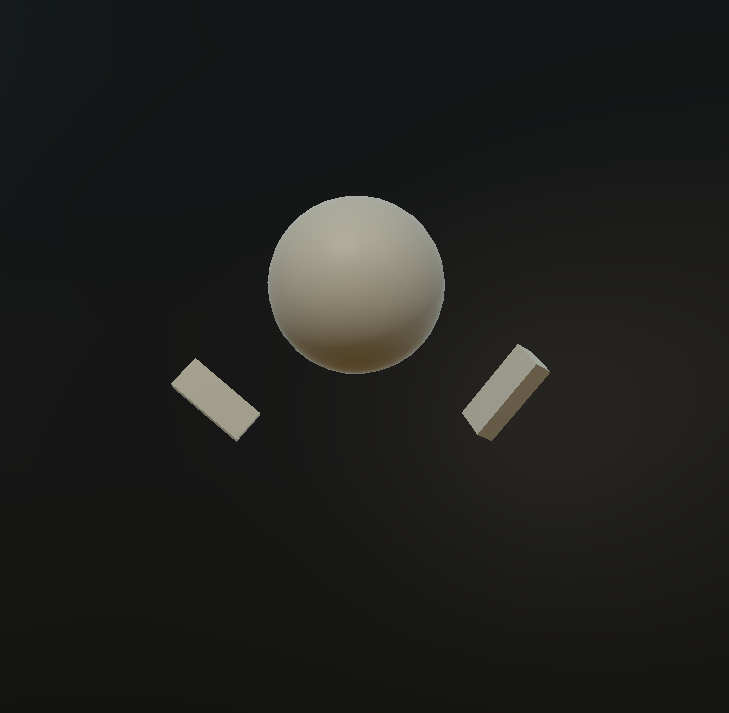
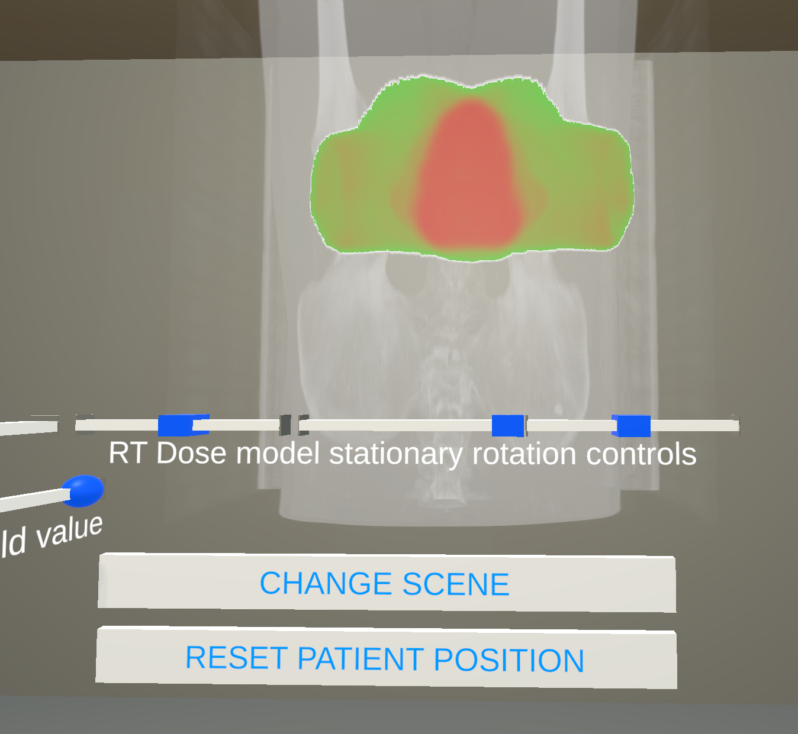

# Thesis Summary: Development of a VR Application for Collaborative Medical Imaging

This thesis presents the development of a virtual reality (VR) application designed to visualize and manipulate medical imaging data—specifically, DICOM CT scans and RT dose data—in a multi-user, interactive VR environment. Built with Unity and utilizing the "NetCode for GameObjects" networking library, the application aims to enhance both educational and diagnostic collaboration through immersive data visualization.

---

## 1. Research and Development Foundations

The initial phase involved extensive research on VR development tools, networking libraries, and visualization techniques suited for handling 3D medical imaging data. Conversations with field experts provided insights that shaped key design choices, particularly around processing and aligning RT dose data with CT imaging, laying a solid foundation for the project.

---

## 2. GUI Design and Usability Enhancements

The application features a redesigned graphical user interface (GUI) optimized for VR use:
- **Stationary Interaction**: The new GUI is intended for seated, stationary use, with all controls easily accessible from within the user’s reach.
- **Slider Controls**: Sliders replace buttons for adjusting model parameters and controlling the SnapZone, enhancing precision and ease of use.
- **Improved Color Scheme**: A dark/bright color scheme was implemented for better readability, adapting the interface for different lighting needs.
- **Compact Layout**: The VR room layout was minimized, bringing all essential components into the user’s immediate field of view.

---

## 3. Multiplayer and Networking

The application includes multiplayer functionality, allowing multiple users to interact in the same VR environment:
- **Synchronization**: Actions like model rotation and density adjustments are synchronized across users through Remote Procedure Calls (RPCs), while some controls remain independent for personalized views.
- **Data Consistency**: Each user loads their dataset individually, but a validation process ensures consistency with the host's data.
- **Networking Challenges**: Due to network limitations, datasets are not shared directly over the network, and players experience synchronization difficulties, notably in avatar position updates.

---

## 4. RT Dose Visualization and Alignment

One of the major technical challenges addressed was the visualization and alignment of RT dose data with the CT patient model:
- **Scaling and Positioning**: Custom scaling methods align RT dose data with the CT model, ensuring proper visualization without distortion.
- **Shader Development**: A custom shader differentiates the RT dose from the patient model, enhancing data clarity. Future improvements could include standardizing colors to indicate specific dose levels.

---

## 5. Challenges and Limitations

Several technical challenges impacted the project:
- **NetworkTransform Component**: Synchronizing player avatars across network instances required complex configuration, and certain behaviors remain unpredictable.
- **Camera Alignment Bug**: A persistent bug causes the host’s camera to shift when a new player joins, creating offset issues. Attempts to resolve this were unsuccessful within the scope of this project.
- **Slider Interaction Limitation**: Currently, only the host can interact with sliders, though changes are synchronized across all instances.
- **Dataset Import Requirement**: Users must load datasets individually due to Unity Transport limitations, affecting ease of use.

---

## 6. Future Directions

The thesis outlines potential enhancements for the application:
- **Improved Data Sharing**: Developing a solution for dataset distribution across network instances could streamline the experience.
- **Enhanced Visualization**: Adding patient structure overlays and a color reference for dose levels could improve model clarity and interpretability.
- **Bug Fixes and Library Independence**: Addressing the desynchronization bug and reducing dependency on VRTKv4 could lead to a more stable and flexible application.
- **Comprehensive Testing**: Further testing with diverse datasets and use cases is recommended to ensure robustness and accuracy, especially for potential professional applications.

---

## 7. Conclusion

This project successfully developed a VR-based multi-user application for medical imaging visualization, though some limitations and bugs remain. The thesis emphasizes the potential of VR for collaborative medical applications and identifies key areas for continued development to enhance functionality, reliability, and user experience in future iterations.
